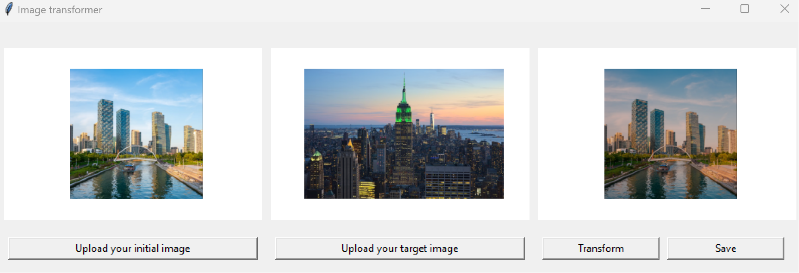

# ImageToImage
This is a puthon code to transform your image to state of other that you like - simply change colors, filters and list of other parameters with one click.

1. Upload initial image
2. Upload target image
3. Click "transform" button
4. Save the result

